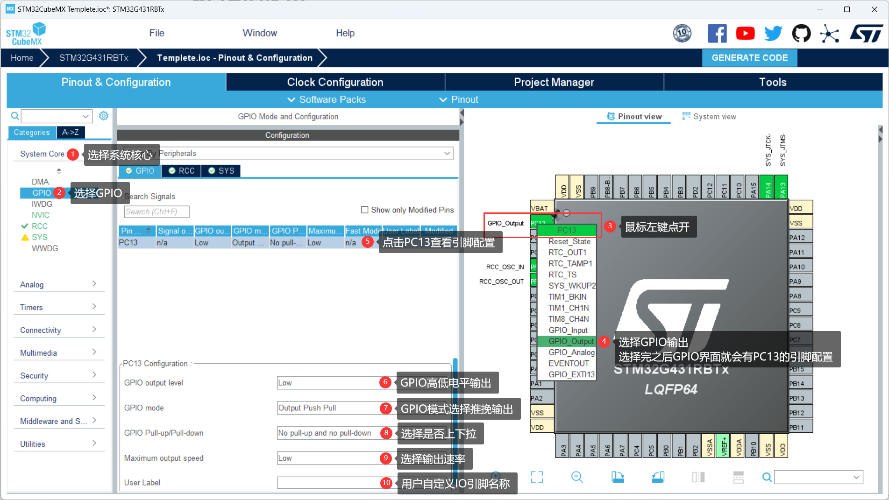
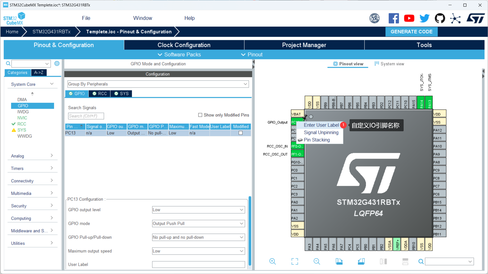
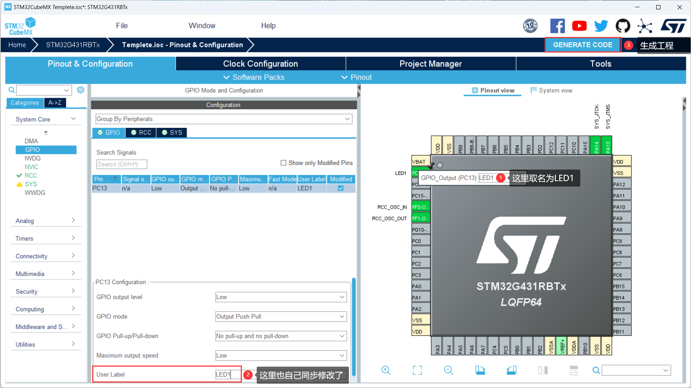
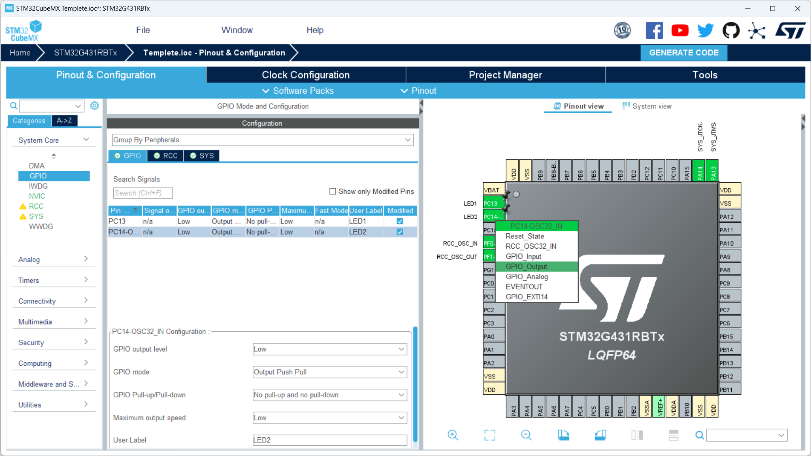
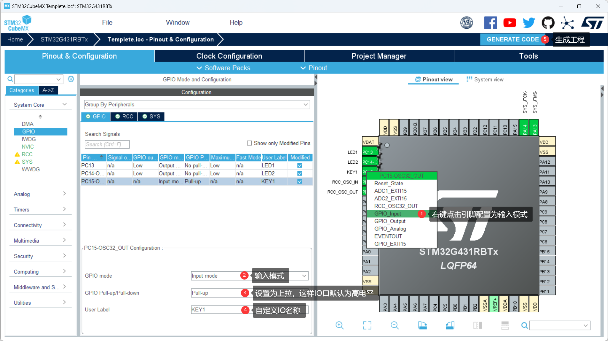
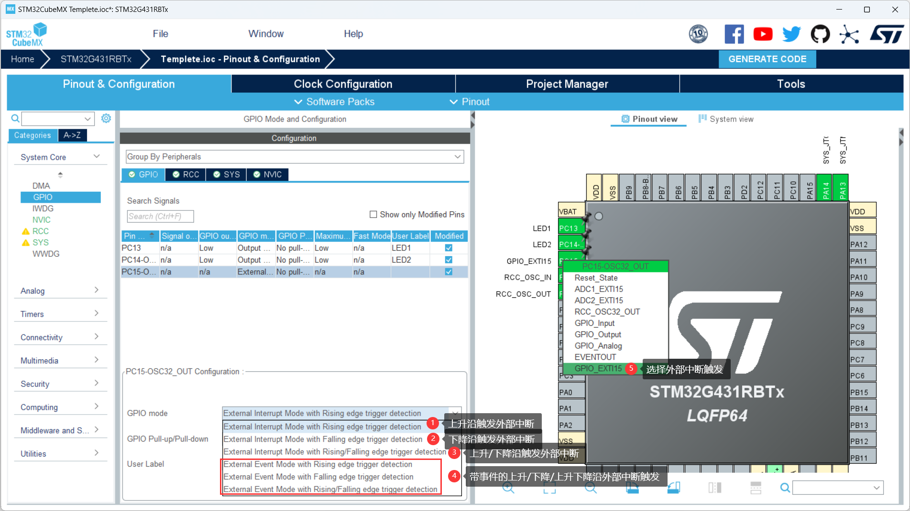

# GPIO的使用

**作者**：

**文档版本**：版本1.0 (2023-6-1)

## 1. GPIO常用的三种模式

+ GPIO_Output：输出高低电平
+ GPIO_Input：检测输入电平状态
+ GPIO_EXTI：外部中断触发

## 2. 使用GPIO引脚输出高低电平

### 2.1 CubeMX引脚配置

**Tips：所有外设的配置过程之前都应进行RCC和SYS的配置，前文已经讲过，后续过程都会跳过这两个步骤。**



<div style="page-break-after:always"></div>

除了可以在User Label里面自定义IO名称之外，也可以用鼠标右键点开IO引脚来修改名字，更加快捷方便，如下：



修改IO名称：



<div style="page-break-after:always"></div>

再以同样方式配置PC14引脚：



### 2.2 程序代码

#### 2.2.1 函数原型

进入keil软件界面，找到`stm32g4xx_hal_gpio.h`文件，可以找到GPIO引脚输出的函数原型：

```C
void     HAL_GPIO_WritePin(GPIO_TypeDef *GPIOx, uint16_t GPIO_Pin, GPIO_PinState PinState);	// 给IO写0写1
void     HAL_GPIO_TogglePin(GPIO_TypeDef *GPIOx, uint16_t GPIO_Pin);						// 翻转IO的状态
```

#### 2.2.2 管脚定义

```C
#define GPIO_PIN_0		((uint16_t)0x0001)  /* Pin 0 selected    */
#define GPIO_PIN_1		((uint16_t)0x0002)  /* Pin 1 selected    */
#define GPIO_PIN_2		((uint16_t)0x0004)  /* Pin 2 selected    */
#define GPIO_PIN_3		((uint16_t)0x0008)  /* Pin 3 selected    */
#define GPIO_PIN_4		((uint16_t)0x0010)  /* Pin 4 selected    */
#define GPIO_PIN_5		((uint16_t)0x0020)  /* Pin 5 selected    */
#define GPIO_PIN_6		((uint16_t)0x0040)  /* Pin 6 selected    */
#define GPIO_PIN_7		((uint16_t)0x0080)  /* Pin 7 selected    */
#define GPIO_PIN_8		((uint16_t)0x0100)  /* Pin 8 selected    */
#define GPIO_PIN_9		((uint16_t)0x0200)  /* Pin 9 selected    */
#define GPIO_PIN_10		((uint16_t)0x0400)  /* Pin 10 selected   */
#define GPIO_PIN_11		((uint16_t)0x0800)  /* Pin 11 selected   */
#define GPIO_PIN_12		((uint16_t)0x1000)  /* Pin 12 selected   */
#define GPIO_PIN_13		((uint16_t)0x2000)  /* Pin 13 selected   */
#define GPIO_PIN_14		((uint16_t)0x4000)  /* Pin 14 selected   */
#define GPIO_PIN_15		((uint16_t)0x8000)  /* Pin 15 selected   */
#define GPIO_PIN_All	((uint16_t)0xFFFF)  /* All pins selected */
```

#### 2.2.3 使用方法

示例1：在主函数里面调用GPIO函数来使IO引脚输出高低电平。

```c
while (1)
{
	/* USER CODE END WHILE */
	HAL_GPIO_WritePin(GPIOC, GPIO_PIN_13, GPIO_PIN_SET);	// PC13引脚输出高电平
    HAL_GPIO_WritePin(GPIOC, GPIO_PIN_14, GPIO_PIN_RESET);	// PC14引脚输出低电平
    /* USER CODE BEGIN 3 */
}
```

示例3：在主函数里面调用GPIO函数来使IO引脚电平翻转。

```c
while(1)
{
    /* USER CODE END WHILE */
	HAL_GPIO_TogglePin(GPIOC, GPIO_PIN_13);;	// PC13引脚电平翻转
    HAL_Delay(200);                             // 200ms延时
    /* USER CODE BEGIN 3 */
}
```

## 3. 使用GPIO引脚检测高低电平

### 3.1 CubeMX引脚配置



### 3.2 程序代码

#### 3.2.1 函数原型

进入keil软件界面，找到`stm32g4xx_hal_gpio.h`文件，可以找到检测GPIO引脚输入的函数原型：

```c
GPIO_PinState	HAL_GPIO_ReadPin(GPIO_TypeDef *GPIOx, uint16_t GPIO_Pin);	// 检测IO引脚电平
```

#### 3.2.3 使用方法

示例1：在主函数里面调用GPIO函数来读取IO引脚电平状态，并且为低电平时，让PC13引脚翻转。

```c
while(1)
{
    /* USER CODE END WHILE */
    if(HAL_GPIO_ReadPin(GPIOC, GPIO_PIN_15) == GPIO_PIN_RESET)  // 按键按下检测到低电平
    {  
		HAL_GPIO_TogglePin(GPIOC, GPIO_PIN_13);  				// 让PC13引脚电平翻转
    }  
    /* USER CODE BEGIN 3 */
}
```

## 4. GPIO外部中断使用

外部中断的使用其实也GPIO_Input模式差不多。

### 4.1 CubeMX引脚配置



### 4.2 程序代码

#### 4.2.1 函数原型

进入keil软件界面，找到`stm32g4xx_hal_gpio.h`文件，可以找到GPIO外部中断的函数原型：

```c
void	HAL_GPIO_EXTI_IRQHandler(uint16_t GPIO_Pin);	// 外部中断服务函数
void    HAL_GPIO_EXTI_Callback(uint16_t GPIO_Pin);		// 外部中断回调函数
```

#### 4.2.2 使用方法

示例1：在外部中断回调函数里面，当触发外部中断时使PC13引脚电平翻转。

```c
void HAL_GPIO_EXTI_Callback(uint16_t GPIO_Pin)
{
	if(GPIO_Pin == GPIO_PIN_15)
  	{
		if(HAL_GPIO_ReadPin(GPIOC, GPIO_PIN_15) == GPIO_PIN_SET)
    	{
            HAL_GPIO_TogglePin(GPIOC, GPIO_PIN_13);  				// 让PC13引脚电平翻转
        }
	 __HAL_GPIO_EXTI_CLEAR_IT(GPIO_PIN_15);
  }
}
```

## 5. HAL_GPIO 函数库详细讲解

### 5.1 函数原型

在`stm32g4xx_hal_gpio.h`文件，可以找到一些函数原型：

```c
void	HAL_GPIO_Init(GPIO_TypeDef *GPIOx, GPIO_InitTypeDef *GPIO_Init);					// GPIO初始化
void	HAL_GPIO_DeInit(GPIO_TypeDef *GPIOx, uint32_t GPIO_Pin);							// GPIO失能
GPIO_PinState	HAL_GPIO_ReadPin(GPIO_TypeDef* GPIOx, uint16_t GPIO_Pin);					// 检测IO引脚电平	
void	HAL_GPIO_WritePin(GPIO_TypeDef* GPIOx, uint16_t GPIO_Pin, GPIO_PinState PinState);	// 给IO写0写1
void	HAL_GPIO_TogglePin(GPIO_TypeDef* GPIOx, uint16_t GPIO_Pin);							// 翻转IO的状态
HAL_StatusTypeDef HAL_GPIO_LockPin(GPIO_TypeDef* GPIOx, uint16_t GPIO_Pin);					// 锁住IO电平
void	HAL_GPIO_EXTI_IRQHandler(uint16_t GPIO_Pin);										// 外部中断服务函数
void	HAL_GPIO_EXTI_Callback(uint16_t GPIO_Pin);											// 外部中断回调函数
```

### 5.2 GPIO的相关配置寄存器

```c
GPIOx_CRL：端口配置低寄存器（32位）
GPIOx_CRH：端口配置高寄存器（32位）
GPIOx_IDR：端口输入寄存器（32位）
GPIOx_ODR：端口输出寄存器（32位）
GPIOx_BSRR：端口位设置/清除寄存器（32位）
GPIOx_BRR：端口位清除寄存器（16位）
GPIOx_LCKR：端口配置锁存寄存器（32位）
```


